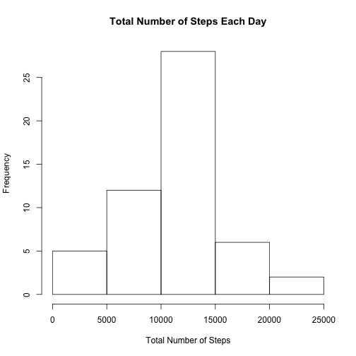
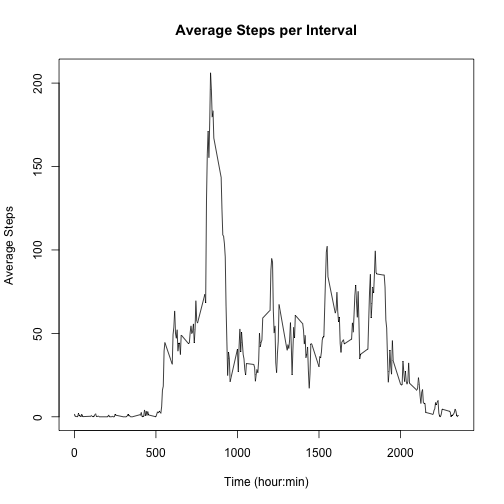
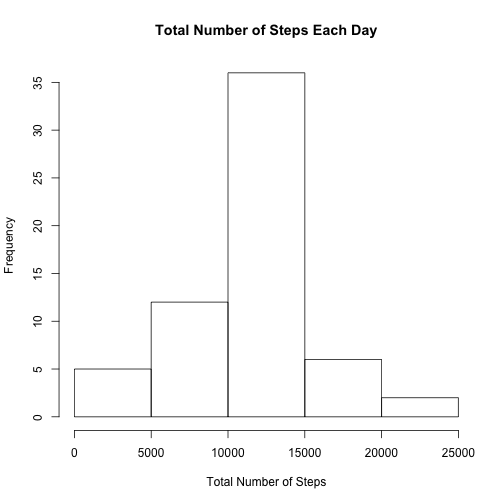
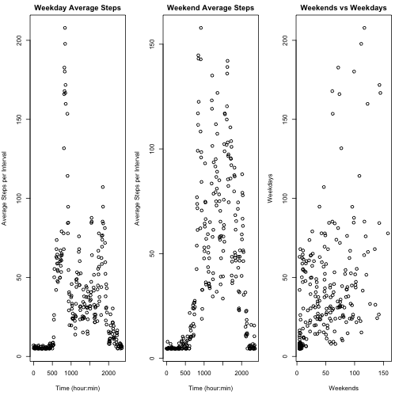

## Loading and preprocessing the data

```r
fileURL <- "https://d396qusza40orc.cloudfront.net/repdata%2Fdata%2Factivity.zip"
download.file(fileURL, destfile = "./dataactivity.zip")
unzip(zipfile = "dataactivity.zip")
activityData <- read.csv(file = "activity.csv", header = TRUE)
```

## What is mean total number of steps taken per day?

```r
## Aggregating total number of steps per day
totalSteps <- aggregate(steps ~ date, activityData, sum)
## Making a histogram of total number of steps per day
hist(totalSteps$steps, xlab = "Total Number of Steps", main = "Total Number of Steps Each Day")
```



```r
## Calculating mean for total number of steps
stepsMean <- mean(totalSteps$steps, na.rm = TRUE)
stepsMean
```

```
## [1] 10766.19
```

```r
## Calculating median for total number of steps
stepsMedian <- median(totalSteps$steps, na.rm = TRUE)
stepsMedian
```

```
## [1] 10765
```

## What is the average daily activity pattern?

```r
## Aggregating average steps per interval
averageStepsPerInterval <- aggregate(steps ~ interval, activityData, mean)
## Plotting average steps per interval
plot(x = averageStepsPerInterval$interval, y = averageStepsPerInterval$steps, xlab = "Time (hour:min)", ylab = "Average Steps", main = "Average Steps per Interval", type = "l")
```



```r
## Finding maximum value for number of steps based on average steps per interval
max <- which(averageStepsPerInterval$steps == max(averageStepsPerInterval$steps,na.rm = TRUE))
interval_max <- averageStepsPerInterval[max, 1]
interval_max
```

```
## [1] 835
```

## Imputing missing values

```r
## Calculating the number of missing values in the dataset 
na_value_count <- sum(is.na(activityData$steps))
## Calculating the mean of steps to later fill for missing values
meanSteps <- mean(activityData$steps, na.rm = TRUE)
meanSteps
```

```
## [1] 37.3826
```

```r
## Creating separate dataset
newActivityData <- activityData
## Replacing all NA values with the mean value calculated earlier
newActivityData$steps[is.na(newActivityData$steps)] <- meanSteps
## Aggregating new total number of steps taken each day
totalStepsNew <- aggregate(steps ~ date, newActivityData, sum)
## Making a histogram of total number of steps per day with new values
hist(totalStepsNew$steps, xlab = "Total Number of Steps", main = "Total Number of Steps Each Day")
```



```r
## Calculating mean values of the new dataset
stepsMeanNew <- mean(totalStepsNew$steps)
stepsMeanNew
```

```
## [1] 10766.19
```

```r
## Calculating median values of the new dataset
stepsMedianNew <- median(totalStepsNew$steps)
stepsMedianNew
```

```
## [1] 10766.19
```

## Are there differences in activity patterns between weekdays and weekends?

```r
## Calculating intervals per day and total number of days in dataset
totIntervalPerDay <- 24*60/5
totaldays <- nrow(newActivityData)/totIntervalPerDay
## Creating new matrix with dimensions based on total intervals per day and total number days in the dataset
activityMatrix <- matrix(newActivityData$steps, nrow = totIntervalPerDay, ncol = totaldays)
## Creating new data frame for average steps with new columns of average steps on weekdays and average steps on weekdays
avgSteps <- data.frame(interval = newActivityData$interval[1:totIntervalPerDay], avgStepsWeekdays = 0, avgStepsWeekends = 0)
## Creating two variables that will be used in a for loop to calculate the number of weekend days and weekdays
totweekends <- 0;
totweekdays <- 0;
## Using a for loop to separate weekend and weekday values while inputting the values into the new data frame and incrementing weekend and weekday number counts
for(i in 1:totaldays) {
	if ((i %% 7 == 6) || (i %% 7 == 0))
	{
		avgSteps$avgStepsWeekends <- avgSteps$avgStepsWeekends + activityMatrix[,i]
	totweekends <- totweekends + 1
	}
	else 
	{
	avgSteps$avgStepsWeekdays <- avgSteps$avgStepsWeekdays + activityMatrix[,i]
	totweekdays <- totweekdays + 1
	}
	}
## Changing weekday and weekend values inputted from the loop to ensure values are averaged based on numbers of weekdays/weekends
avgSteps$avgStepsWeekdays <- avgSteps$avgStepsWeekdays/totweekdays
avgSteps$avgStepsWeekends <- avgSteps$avgStepsWeekends/totweekends

## Plotting average steps for weekdays, weekends, and creating a scatterplot comparing the two
par(mfrow = c(1, 3), mar = c(5, 4, 2, 1))
with(avgSteps, {
	plot(interval, avgStepsWeekdays, main = "Weekday Average Steps", xlab = "Time (hour:min)", ylab = "Average Steps per Interval")
	plot(interval, avgStepsWeekends, main = "Weekend Average Steps", xlab = "Time (hour:min)", ylab = "Average Steps per Interval")
	plot(avgStepsWeekends, avgStepsWeekdays, main = "Weekends vs Weekdays", xlab = "Weekends", ylab = "Weekdays")
	})
```


